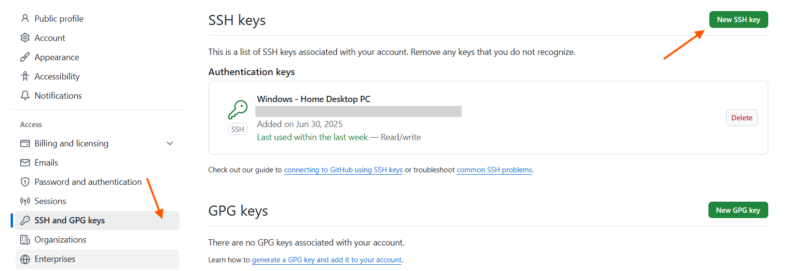

# Git + GitHub

**Git** — це система керування версіями. Вона дозволяє тобі відстежувати зміни в коді, працювати над проєктом разом з іншими, створювати різні версії (гілки) та об'єднувати їх.

### Основні фішки:

- Відстеження історії змін
- Робота в команді
- Відновлення попередніх версій
- Відокремлена робота у гілках

**GitHub** — це платформа (веб-сервіс), де ти можеш зберігати свої репозиторії Git онлайн.

### GitHub дозволяє:

- Співпрацювати з іншими через pull requests
- Публікувати та документувати проєкти
- Використовувати CI/CD, обговорення, таски і багато іншого

## 🔥 Початок роботи з Git

Перше, що вам слід зробити під час встановлення Git, це встановити ім'я користувача та адресу електронної пошти. Це важливо, оскільки кожен коміт Git використовує цю інформацію, і вона незмінно вбудована в коміти, які ви починаєте створювати:

```
$ git config --global user.name "John Doe"
$ git config --global user.email johndoe@example.com
```

Знову ж таки, вам потрібно зробити це лише один раз, якщо ви передаєте `--global`, оскільки тоді Git завжди використовуватиме цю інформацію для вашого користувача в цій системі. Якщо ви хочете перевизначити це іншим іменем або адресою електронної пошти для певних проектів, ви можете виконати команду без `--global`, коли ви перебуваєте в цьому проекті.

Чтобы посмотреть все установленные настройки и узнать где именно они заданы, используйте команду:

`$ git config --list --show-origin`

Якщо ви хочете перевірити налаштування конфігурації, ви можете скористатися `git config --list` командою, щоб переглянути список усіх налаштувань, які Git може знайти на даний момент.

📌 **Корисна порада:**  
 Якщо хочеш, щоб команда `git config --list` просто показувала весь вивід одразу, можеш зробити це так:

```
git config --list | cat
```

Або повністю вимкнути pager для Git:

```
git --no-pager config --list
```

## 🔥 Створення ключа SSH та його додавання до ssh-agent

Ви можете згенерувати новий SSH-ключ на вашому локальному комп’ютері. Після генерації ключа ви можете додати відкритий ключ до свого облікового запису на GitHub.com, щоб увімкнути автентифікацію для операцій Git через SSH.

Відкрийте Git Bash. Вставте текст нижче, замінивши електронну адресу, використану в прикладі, на вашу електронну адресу GitHub.

```
ssh-keygen -t ed25519 -C "your_email@example.com"
```

Це створює новий SSH-ключ, використовуючи надану електронну адресу як мітку.

Тепер знаходимо публічну версію щойно створеного ключа:

```
start ~/.ssh
```

Відкрити в блокноті та скопіювати вміст файлу з розширенням **pub**.

Привязуємо ключ в своєму GitHub: [Налаштування -> Ключі](https://github.com/settings/keys)



## 🔥 Створення нового репозиторію

Щоб скопіювати новий репозиторій через ssh-key на ПК потрібно скористатися:

```
git clone git@github.com:panteleimonov/some-project.git
```

Create a new repository on the command line:

```
echo "# dev-notes" >> README.md
git init
git add README.md
git commit -m "first commit"
git branch -M main
git remote add origin git@github.com:panteleimonov/dev-notes.git
git push -u origin main
```

Push an existing repository from the command line:

```
git remote add origin git@github.com:panteleimonov/dev-notes.git
git branch -M main
git push -u origin main
```

## 🔥 Команди Git

- `git status` – перевірка статуса.
- `git add index.html` – додати файл в “індекс” (staging area).
- `git reset` – для скасування змін у різних частинах репозиторію: у комітах, індексі (staging area) та робочій директорії.
- `git commit -m "Initial project structure"` – створює новий коміт — тобто ЛОКАЛЬНО зберігає знімок змін, що були додані до індексу (staging area).
- `git log` – показує історію комітів у поточній гілці
- `git push` – надсилає коміти з локального репозиторію до віддаленого.
- `git pull` використовується для отримання останніх змін з віддаленого репозиторію та автоматичного їх злиття з поточною локальною гілкою.
- `git pull --rebase` використовується для того, щоб синхронізувати локальну гілку з віддаленою, але замість звичайного злиття (merge) виконується перебазування змін. Це допомагає зберегти чистішу, лінійну історію комітів.

## 🔥 Staging area

🧩 **Staging area** — це проміжна зона, яка дозволяє тобі **підготувати зміни перед комітом**. Вона також називається **index** або **cache**, і є ключовим елементом у Git-робочому процесі.

### 🔍 Як це працює:

- Коли ти змінюєш файли у своєму проєкті, ці зміни зберігаються у **робочій директорії**.
- Щоб підготувати їх до коміту, ти додаєш їх у staging area за допомогою команди `git add`.
- Лише ті файли, які знаходяться у staging area, потраплять у наступний коміт (`git commit`).

### 🛠️ Основні команди:

- `git add <файл>` — додає файл до staging area.
- `git status` — показує, які файли змінені, а які вже додані до staging.
- `git reset <файл>` — прибирає файл зі staging area.
- `git add -p` — дозволяє додати **частину змін** (hunk) у staging, дуже корисно для точного контролю.

### 🎯 Навіщо це потрібно:

- **Гнучкість**: можна комітити лише частину змін, залишаючи інші на потім.
- **Контроль**: дозволяє групувати логічно пов’язані зміни в окремі коміти.
- **Перевірка**: перед комітом можна переглянути staged зміни (`git diff --cached`).

Це як чернетка перед публікацією — **staging area** дозволяє тобі вирішити, що саме потрапить в історію проєкту.

## 🔥 Git reset

🔄 **`git reset`** — це потужна команда в Git, яка дозволяє **відкотити зміни** в репозиторії. Вона може змінювати положення HEAD, staging area (індекс) і навіть робочу директорію — залежно від режиму.

### 🧠 Основні режими `git reset`:

| Режим     | Що змінюється                      | Опис                                                               |
| --------- | ---------------------------------- | ------------------------------------------------------------------ |
| `--soft`  | HEAD                               | Зміни залишаються в staging area, готові до коміту                 |
| `--mixed` | HEAD + staging                     | Зміни залишаються в робочій директорії, але видаляються зі staging |
| `--hard`  | HEAD + staging + робоча директорія | Всі незбережені зміни видаляються безповоротно                     |

> ⚠️ `git reset --hard` — небезпечна команда, бо **видаляє всі незакомічені зміни**. Використовуй її обережно!

### 🛠️ Приклади використання:

- `git reset --soft HEAD~1` — відкат останнього коміту, але зміни залишаються staged.
- `git reset --mixed HEAD~1` — відкат коміту, зміни повертаються в unstaged.
- `git reset --hard HEAD~1` — повний відкат, включно з видаленням змін у файлах.

### 🔍 Для окремих файлів:

- `git reset <файл>` — прибирає файл зі staging area (аналог `git restore --staged`).
- `git reset -p` — дозволяє **вибірково** скинути частини змін (hunks), як у `git add -p`.

### 🧭 Коли використовувати:

- Щоб **перегрупувати коміти** перед пушем.
- Щоб **відкотити помилкові зміни**, які ще не були надіслані в remote.
- Щоб **очистити staging area**, не торкаючись файлів.
